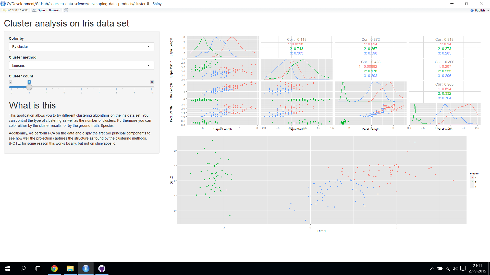

Cluster analysis of Iris data set
========================================================
author: Bertjan Broeksema
date: 26-9-2015

Exploratory analysis
========================================================

Exploratory analysis (EA) is in many analyses processes an important first step.
It helps to get some sense of structure in the data set at hand and to identify questions that can be asked based on this data.

Cluster analysis is one of the many tools that is used for EA. 
There are many algorithms though and it is not always easy to understand why items are clustered together.

In this (simple) shiny app, [clusterUi](https://bbroeksema.shinyapps.io/clusterUi), two well known cluster algorithms are compared on a well-understood data set.

The data
========================================================


```r
names(iris)
```

```
[1] "Sepal.Length" "Sepal.Width"  "Petal.Length" "Petal.Width" 
[5] "Species"     
```

The data we use in this app is the IRIS data which has five variables.

***

Four predictor variables descripe properties of the plant, and the fifth describes the species.
In a classical machine learning setting we would use the four variables as input and the fifth as a predicted variable for a predictive model.


The application
========================================================

The clusterUi app tries to answer the following question:

How well can different clustering algorithms capture the ground truth clustering?

To this end the application allows for choosing different clustering algorithms (kmeans and hierarchical).
We know that there are 3 species in the data set.
In the typical case it is not known though how many clusters we should expect.
Therefor the application also allows for changing the number of clusters.

Finally, it also integrates PCA to compare how structure is captured in the raw variables vs. projected variables.
**NOTE:** This only works locally for me not in shinyapps.io.


The application - screenshot
========================================================


